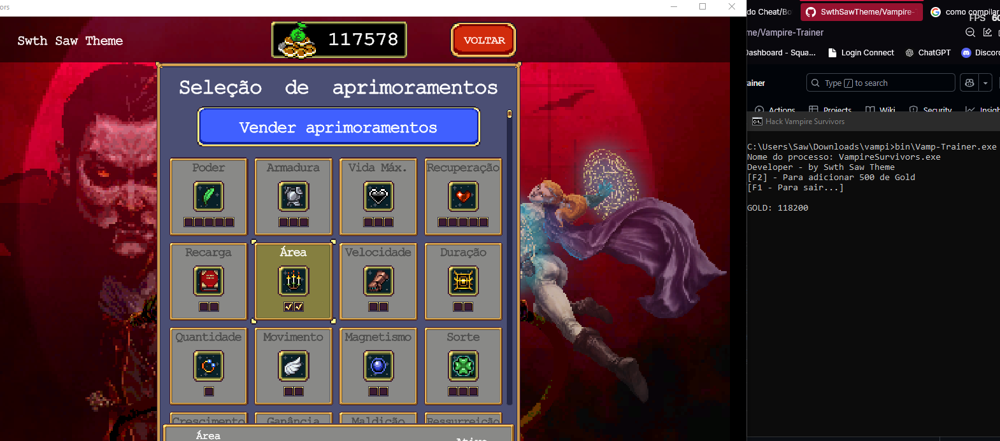

# Vampire Survivors in C++

## Descrição
Projeto criado para fins didáticos e aprendizagem usando Windows API

## Estrutura do Projeto

- **main.cpp**: Arquivo principal com o código-fonte da aplicação.
- **json.hpp**: Biblioteca de terceiros para manipulação de JSON.
- **settings.json**: Arquivo de configuração do projeto.
- **bin/Vamp-Trainer.exe**: Binário executável gerado pelo projeto.
- **.git/**: Diretório de controle de versão.

## Pré-requisitos
- Compilador C++ (compatível com o padrão C++17 ou superior).
- Sistema operacional Windows para executar o binário fornecido.

## In-Game


## Como Usar

1. **Compilar o projeto**:
    ```bash
    g++ -std=c++17 -o Vampi main.cpp
    ```

2. **Executar o binário**:
    No CMD, basta executar `bin/Vamp-Trainer.exe`.

3. **Configurar**:
    Ajuste o arquivo `settings.json` conforme necessário para personalizar o comportamento do programa.

## Contribuição
Sinta-se à vontade para clonar o repositório, criar um branch e enviar pull requests.

## Licença
Este projeto está licenciado sob a MIT License

---
